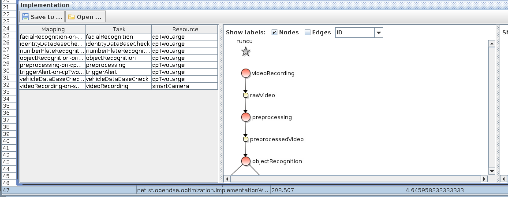
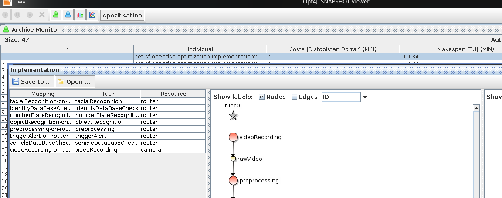

# Results for task 2.2

As expected, the minimization of the makespan results in a maximization
of costs. All tasks are executed on the fastest but most expensive cloud instance
cpTwoLarge and the images are recored on the smartCamera.

The cost optimization leads in return to much longer makespans.
This can be seen in the following screenshot, here all tasks are executed
on the router and instead of a smart camera, a normal one is used.

